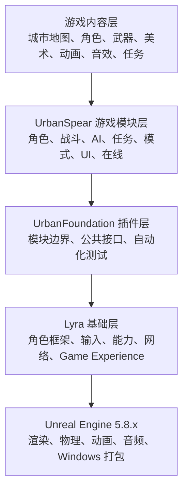
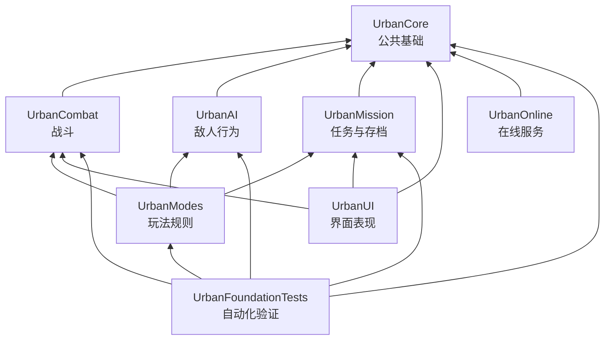
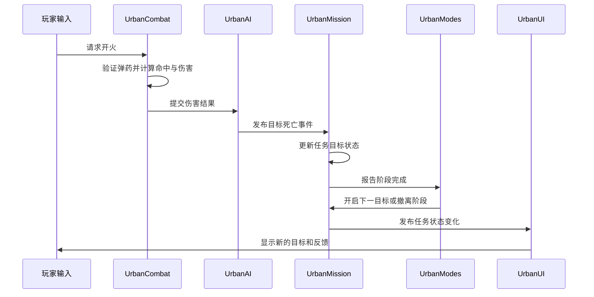

# Project Urban Spear 游戏开发架构

- 文档状态：已批准的工程架构说明
- 更新日期：2026-07-30
- 目标平台：Windows 64 位
- 基础技术：Unreal Engine 5.8.x、Lyra Starter Game 5.8、C++、蓝图、数据资产、Game Feature 插件

## 1. 架构目标

Project Urban Spear 是一款写实近未来城市战术射击游戏。工程架构需要同时满足以下目标：

1. 首阶段能够交付可独立运行的单机 PVE 章节；
2. 支持第一人称与第三人称共用同一套角色和战斗数据；
3. 从第一天建立多人联网边界，后续加入合作与 PvP 时不重写核心系统；
4. 将角色、战斗、AI、任务、模式、UI 和在线服务拆成可测试模块；
5. 允许地图、任务和玩法模式复用同一套基础系统；
6. 将核心规则、内容编排和数值配置分离；
7. 支持自动化测试、Windows 打包和持续性能验证；
8. 以可扩展的纵向切片逐步达到高品质 3D 制作目标，而不是先建设无法验证的大型空场景。

## 2. 总体分层



各层职责如下：

- **Unreal Engine**：提供渲染、物理、动画、音频、资源管理、编辑器和 Windows 构建能力；
- **Lyra**：提供成熟的角色、输入、Gameplay Ability System、多人网络和模块化 Game Feature 参考框架；
- **UrbanFoundation**：承载本项目原创功能，避免直接污染 Lyra 上游代码；
- **UrbanSpear 游戏模块**：实现角色、枪械、AI、任务、模式、UI 和在线服务；
- **游戏内容层**：使用蓝图、数据资产和美术资源组合出可游玩的章节与模式。

## 3. 工程组织

目标工程结构如下：

```text
3D_GAME/
├─ Config/                         游戏、输入、画质和平台配置
├─ Content/                        地图、角色、武器、动画、音效、UI、特效
├─ Source/                         UrbanSpear Game/Editor Target 与工程入口
├─ Plugins/
│  └─ GameFeatures/
│     └─ UrbanFoundation/
│        ├─ UrbanCore/
│        ├─ UrbanCombat/
│        ├─ UrbanAI/
│        ├─ UrbanMission/
│        ├─ UrbanModes/
│        ├─ UrbanUI/
│        ├─ UrbanOnline/
│        └─ UrbanFoundationTests/
├─ Build/                          环境检查、编译、测试和 Windows 打包工具
├─ ThirdParty/                     第三方资源登记与许可证信息
└─ docs/                           设计、架构、实施计划和发布文档
```

主工程只保留项目身份、Target、配置和必要入口。原创玩法集中在 `UrbanFoundation` Game Feature 插件中。

## 4. 模块架构

### 4.1 UrbanCore

公共基础层，负责：

- 角色基础状态与公共组件；
- 移动、视角和交互接口；
- 阵营、队伍与玩家资料；
- 公共数据结构、Gameplay Tag 和事件定义；
- 其他模块共享但不属于具体玩法的基础规则。

`UrbanCore` 不依赖 UI、任务模式或具体武器实现，避免形成循环依赖。

### 4.2 UrbanCombat

战斗领域模块，负责：

- 武器、弹药、换弹和开火；
- 命中、伤害、护甲和死亡结果；
- 配件、投掷物和战术装备；
- 战斗状态和必要的网络同步。

该模块只计算战斗结果，不判断任务是否完成。

### 4.3 UrbanAI

敌人行为模块，负责：

- 视觉、听觉和威胁感知；
- 巡逻、警戒、搜索和追踪；
- 掩体、压制、包抄、增援和撤退；
- AI 战术状态及其必要的同步和调试信息。

AI 可以报告发现玩家、呼叫增援或单位死亡，但不直接决定任务胜负。

### 4.4 UrbanMission

任务与进度模块，负责：

- 任务目标和状态转换；
- 检查点、失败条件、评分和撤离；
- 章节进度和必要世界状态；
- 本地存档接口及安全恢复。

任务系统订阅战斗、交互和区域事件，不依赖具体枪械类型或地图蓝图实现。

### 4.5 UrbanModes

玩法规则组合层，负责：

- 剧情任务撤离；
- 据点进攻；
- 生存防守；
- 后续合作与 PvP 规则；
- 难度、出生、重生、胜负和结算规则。

模式模块复用角色、战斗、AI 和任务系统，不复制这些系统的实现。

### 4.6 UrbanUI

表现与交互界面层，负责：

- 主菜单、模式选择和装备配置；
- HUD、任务提示、交互反馈和结算；
- 画质、音频、控制、字幕和无障碍设置。

UI 只读取状态和发出用户意图，不直接修改生命、弹药或任务结果。

### 4.7 UrbanOnline

在线服务边界，负责：

- 创建、搜索和加入游戏会话；
- 邀请、房间和连接状态；
- 断线恢复边界；
- 后续专用服务器接口。

角色、武器和任务等领域数据的复制由其所属模块负责；`UrbanOnline` 不包办所有网络状态。

### 4.8 UrbanFoundationTests

自动化测试模块，负责：

- 模块加载烟雾测试；
- 项目标识和 Target 验证；
- 公共接口与关键基础行为检查；
- Editor 和 Windows Development 构建验证入口。

## 5. 依赖方向



架构约束：

1. 底层模块不得反向依赖上层表现模块；
2. 不允许通过相互引用形成循环依赖；
3. 游戏模式不得复制角色、枪械、AI 或伤害逻辑；
4. UI 不得成为游戏状态的权威来源；
5. 地图蓝图不得承载可复用的核心战斗规则；
6. 模块之间优先使用接口、Gameplay Tag、事件或消息通信。

## 6. 系统通信逻辑

一次“玩家消灭任务目标”的完整数据流如下：



各模块只处理自己的领域，不通过强耦合方式接管其他系统。

## 7. C++、蓝图和数据资产分工

### C++

用于需要稳定、可测试和可联网的核心规则：

- 角色状态；
- 枪械、伤害和护甲；
- AI 基础状态；
- 任务、检查点和存档接口；
- 网络权威验证；
- 模块接口和公共组件。

### 蓝图

用于需要快速迭代的内容编排：

- 关卡事件；
- 敌人出生和增援；
- 门、机关和交互物；
- 任务流程连接；
- 动画、特效和音频触发；
- UI 连接与设计师调整。

### 数据资产

用于不修改程序即可调整的配置：

- 武器伤害、射速、后坐力和弹匣；
- 敌人能力、感知和战术参数；
- 装备和战利品定义；
- 任务、模式和难度配置。

原则可概括为：

```text
C++ 制定规则
蓝图编排内容
数据资产调整参数
```

## 8. 第一与第三人称架构

第一与第三人称使用同一个角色实体、同一套武器、弹药、伤害、装备和任务状态。

```text
同一个玩家角色
├─ 第一人称摄像机与表现组件
├─ 第三人称摄像机与表现组件
├─ 共享移动状态
├─ 共享武器和弹药
├─ 共享生命和护甲
└─ 共享任务及联网身份
```

切换视角只改变摄像机、瞄准表现、动画呈现和屏幕反馈，不创建第二套角色逻辑。

## 9. 地图、任务与模式分离

城市地图提供可复用的空间标记：

- 玩家与 AI 出生点；
- 任务目标点；
- 防守和占领区域；
- 补给位置；
- 撤离点；
- 可封锁道路；
- AI 巡逻、搜索和增援区域。

模式和任务通过数据配置使用这些标记：

```text
城市地图 + 剧情任务配置 = 剧情战术章节
城市地图 + 占领规则配置 = 据点进攻
城市地图 + 波次规则配置 = 生存防守
```

地图不写死具体玩法，因此同一城市区域可以安全复用。

## 10. 联机权威架构

即使首阶段以单机 PVE 为主，关键系统仍按服务器权威逻辑设计：

```text
玩家提交操作意图
→ 权威端验证条件
→ 权威端计算正式结果
→ 将结果复制给相关玩家
→ 客户端播放表现和反馈
```

例如开火时，本地可以立即播放基础反馈以保证手感，但弹药、命中、伤害和死亡结果由权威端确认。这样后续增加合作和 PvP 时，不需要重写核心战斗与任务规则。

## 11. 资源生产架构

美术资源遵循以下生产流程：

```text
概念设计
→ 灰盒验证
→ 正式模型
→ UV、材质与贴图
→ 碰撞与物理设置
→ LOD/Nanite 与远近表现
→ 动画、灯光和特效
→ 性能检查
→ 进入正式地图
```

大型模型、贴图、动画和音频使用 Git LFS 管理。第三方资源必须登记来源、许可证、用途和再分发限制。

## 12. 测试与构建架构

测试分为四层：

1. **模块测试**：检查模块、插件和项目 Target 是否能够加载；
2. **功能测试**：检查视角、开火、换弹、AI、任务和检查点；
3. **关卡测试**：检查流程可完成性、碰撞、AI 卡点和撤离区域；
4. **Windows 构建测试**：检查独立程序启动、进入游戏、退出、崩溃和性能。

每个阶段都必须保持以下链路可执行：

```text
环境验证
→ Editor 编译
→ 自动化测试
→ Windows Development 打包
→ 独立启动测试
```

## 13. 开发与交付流程

每项功能采用独立分支和审查流程：


主分支保持可验证状态。未通过环境、编译、测试或授权检查的内容不得合并。

## 14. 实施顺序

```text
工程与版本控制地基
→ Unreal/Lyra 基线
→ UrbanSpear Target 与模块骨架
→ Editor 编译、自动化测试和 Windows 基础包
→ 角色、移动和双视角
→ 枪械、伤害和战术装备
→ 敌人战术 AI
→ 任务、检查点和存档
→ 城市灰盒章节
→ 正式美术、动画、UI、音效和特效
→ 合作与在线功能
→ 画质、性能和 Windows 发布
```

当前基础里程碑的目标是获得一个可靠、可扩展、可测试、可在 Windows 启动的游戏骨架。高品质画面和大规模内容将在核心系统稳定后逐阶段加入。

## 15. 架构总结

Project Urban Spear 使用 Unreal Engine 作为引擎、Lyra 作为射击游戏底盘、UrbanFoundation 作为独立 Game Feature 插件，将角色、战斗、AI、任务、模式、UI 和在线服务拆成边界清晰、可以独立测试的模块，再通过蓝图、数据资产和城市资源组合成完整游戏。
