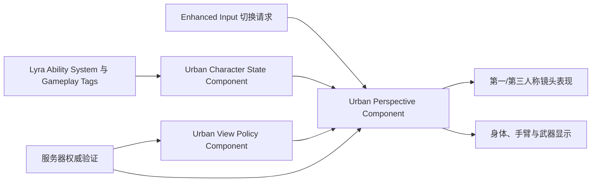

# Project Urban Spear 角色与双视角系统设计

- 日期：2026-07-31
- 状态：已批准，等待书面规格复核
- 目标平台：Windows 64 位
- 引擎基线：Unreal Engine 5.8.x、Lyra Starter Game 5.8
- 所属里程碑：角色与镜头
- 依赖分支：`feat/urban-spear-foundation`（PR #5）

## 1. 目标

在不直接修改 Lyra 核心源码的前提下，为 Project Urban Spear 建立一套可测试、可联网扩展的角色视角系统。玩家在单机 PVE 和合作 PVE 中可以选择第一人称或第三人称；PvP 等受限玩法可以由服务器强制第一人称。

第一和第三人称必须共用同一套角色、移动、生命、姿态、武器、弹药和战斗状态。切换视角只改变镜头与本地表现，不创建两套角色或两套战斗逻辑。

## 2. 本阶段范围

本阶段交付：

1. 第一人称和第三人称共享状态；
2. 右肩、左肩第三人称镜头；
3. 玩家视角切换输入与状态限制；
4. 玩法模式和服务器视角策略；
5. 第一人称身体、手臂和武器显示规则；
6. 第三人称镜头碰撞与基本反穿墙规则；
7. Lyra 输入、Gameplay Ability System 和网络边界集成；
8. 自动化测试、测试地图和 Windows 可玩验收。

本阶段不包含：

- 最终角色模型、服装和高品质动作捕捉；
- 完整枪械、伤害和弹道实现；
- 掩体吸附系统；
- 完整手柄键位和设置菜单；
- 合作房间、匹配、专用服务器部署；
- 最终 PvP 反作弊系统。

上述内容只保留接口和扩展边界，由后续里程碑实现。

## 3. 方案选择

采用“保留 Lyra，通过 UrbanCore 组件扩展”的方案。

不直接修改 Lyra 角色和镜头核心代码，以降低升级冲突；也不完全重写角色框架，以复用 Lyra 已有的 Enhanced Input、Gameplay Ability System、角色移动、动画和联网能力。

原创逻辑集中在 `UrbanFoundation/UrbanCore`。内容配置和测试地图可以位于 UrbanFoundation Game Feature 内容目录中。

## 4. 总体结构

### 4.1 Urban Character State Component

统一提供镜头系统需要读取的角色状态：

- 静止和普通移动；
- 蹲伏；
- 冲刺；
- 瞄准；
- 翻越或其他移动能力；
- 倒地；
- 死亡；
- 重生初始化。

组件优先读取 Lyra Ability System 和 Gameplay Tags，不复制已经存在的能力状态。状态变更通过事件通知视角组件，不使用每帧扫描全部能力的方式。

### 4.2 Urban Perspective Component

负责：

- 保存玩家期望视角和服务器接受视角；
- 判断当前是否允许切换；
- 执行第一/第三人称和左右肩过渡；
- 应用身体、手臂和武器显示规则；
- 在死亡、重生和玩法策略变化时修正视角；
- 为 UI、动画和后续战斗系统提供只读状态接口。

### 4.3 Urban View Policy Component

负责读取玩法模式提供的视角策略。首阶段支持：

- `FreeChoice`：允许第一和第三人称；
- `FirstPersonOnly`：强制第一人称；
- `ThirdPersonOnly`：保留给特殊玩法或测试；
- `Disabled`：禁用主动切换，使用玩法指定默认视角。

服务器策略优先于玩家本地设置。单机 PVE 和合作 PVE 默认使用 `FreeChoice`；PvP 可以使用 `FirstPersonOnly`。

## 5. 视角状态模型

接受后的视角状态包括：

- `FirstPerson`；
- `ThirdPersonRight`；
- `ThirdPersonLeft`；
- `ForcedFirstPerson`。

系统另行保存玩家最近一次合法自由选择，用于重生或退出强制策略后恢复。

`ForcedFirstPerson` 是策略结果，不等同于玩家主动选择第一人称。这样可以避免玩家进入 PvP 后覆盖其 PVE 偏好。

## 6. 输入与切换规则

### 6.1 默认输入

- `V`：在第一人称和第三人称之间切换；
- `Q`：第三人称下切换左右肩。

输入通过 Lyra Enhanced Input Action 和 Mapping Context 配置，不在角色 C++ 中写死。后续设置菜单可以重新绑定。

### 6.2 允许切换

以下状态允许视角切换：

- 静止；
- 普通移动；
- 蹲伏。

### 6.3 禁止切换

以下状态拒绝视角切换：

- 正在瞄准；
- 正在冲刺；
- 正在翻越；
- 倒地；
- 死亡。

请求被拒绝时保留当前视角和玩家上一次选择。限制解除后不自动执行之前被拒绝的请求，避免镜头在玩家没有再次输入时突然跳转。

第三人称肩位切换遵守相同限制。第一人称下按肩位键不改变当前镜头，但可以保留最近的第三人称肩位。

### 6.4 重生和策略变化

- 重生时恢复当前玩法允许的最近一次玩家视角；
- 若玩法强制第一人称，则重生后保持第一人称；
- 从强制策略返回自由策略时，恢复进入强制策略前的合法选择；
- 死亡镜头不属于本阶段的自由视角状态，由后续死亡/观战系统接管。

## 7. 镜头表现

### 7.1 第一人称

- 镜头位于角色眼睛附近；
- 跟随头部方向，但过滤会导致眩晕或严重抖动的高频动画位移；
- 默认视野、瞄准视野和过渡速度由数据资产配置；
- 本地玩家不能看见头部模型内部；
- 玩家向下观察时仍可看到腿部和必要的身体部分；
- 视觉后坐力、受伤震动和镜头晃动必须预留强度配置。

### 7.2 第三人称

- 默认使用距离受控的右肩越肩镜头；
- 支持平滑切换到左肩；
- 镜头使用碰撞检测，接近墙体时自动缩短距离；
- 镜头不得进入墙体、角色身体或大型场景碰撞体；
- 角色紧贴障碍时限制横向偏移，减少利用镜头穿墙观察；
- 第三人称不是自由飞行镜头，距离上限由数据配置限定。

### 7.3 过渡

第一和第三人称之间使用约 0.2 秒的平滑过渡。具体时间由数据资产调整，但默认范围为 0.15 至 0.30 秒。

过渡期间：

- 不改变角色位置和朝向权威；
- 不重复触发输入；
- 不允许新的视角切换请求覆盖当前过渡；
- 如服务器策略变化，服务器强制结果可以中断本地过渡。

## 8. 身体、手臂与武器显示

角色始终保留一个世界角色实体和一套权威战斗数据。

### 8.1 世界身体

- 其他玩家始终看到完整第三人称角色身体；
- 世界阴影、联网角色和后续回放使用完整身体；
- 本地第一人称只隐藏容易穿入镜头的头部和必要上身部分；
- 隐藏策略只影响本地渲染，不影响服务器碰撞或其他客户端显示。

### 8.2 第一人称表现

本地玩家使用专用第一人称手臂和武器表现，以保证瞄具对齐、换弹可读性和动画质量。第一人称表现不是第二套武器：

- 弹药、开火、换弹和装备状态来自同一战斗组件；
- 动画事件只请求战斗动作，不能直接修改权威弹药或伤害；
- 后续可以用共享动画状态驱动第一人称手臂和世界身体。

### 8.3 第三人称表现

第三人称显示完整身体和世界武器。进入瞄准时镜头靠近肩部、缩小视野并显示适合的准星；瞄准期间锁定当前视角和肩位。

## 9. 射击视线与反穿墙边界

完整战斗系统由后续 UrbanCombat 里程碑实现，但本阶段必须定义边界：

1. 玩家瞄准意图可以从摄像机中心获得；
2. 实际射击起点必须使用真实武器枪口；
3. 摄像机瞄准点与枪口之间需要进行遮挡检查；
4. 枪口被墙体或掩体遮挡时不能从摄像机位置生成子弹；
5. 命中和伤害由服务器权威验证；
6. 第三人称镜头位置不能扩大真实射击权限。

本阶段可以用调试射线或测试接口验证该边界，不需要提前实现完整枪械。

## 10. 网络权威与复制

- 客户端发送视角或肩位切换请求；
- 服务器验证玩法策略、角色状态和请求合法性；
- 服务器保存并返回接受后的紧凑视角枚举；
- 玩法策略由服务器权威并复制；
- 不复制每帧摄像机位置、旋转或插值进度；
- 本地镜头插值属于客户端表现；
- 非拥有者只接收其动画或玩法真正需要的状态；
- 非法、过期或受限请求不改变服务器状态。

单机模式仍通过同一验证路径运行，避免形成只能在本地工作的特殊实现。

## 11. 数据和内容配置

新增视角配置数据资产，至少包含：

- 第一人称默认视野；
- 第三人称视野；
- 右肩和左肩偏移；
- 第三人称最小、最大距离；
- 镜头碰撞半径；
- 视角切换时间；
- 肩位切换时间；
- 瞄准时镜头偏移和视野；
- 镜头晃动、视觉后坐力和受伤震动强度。

C++ 提供安全默认值和范围校验。缺失或无效数据资产时使用安全默认配置，并记录可读日志，不导致角色无法生成。

## 12. 事件与错误处理

视角组件提供以下事件：

- 视角切换请求；
- 请求被接受；
- 请求被拒绝及原因；
- 接受视角发生变化；
- 肩位发生变化；
- 玩法策略发生变化；
- 过渡完成。

拒绝原因至少区分：状态受限、玩法受限、过渡进行中、组件未初始化和无效请求。首阶段通过日志和自动化断言验证；后续 UrbanUI 可以选择是否显示提示。

## 13. 自动化测试

UrbanFoundationTests 至少覆盖：

1. 默认视角初始化；
2. 第一和第三人称合法切换；
3. 第三人称左右肩切换；
4. 静止、普通移动和蹲伏允许切换；
5. 瞄准、冲刺、翻越、倒地和死亡拒绝切换；
6. 被拒绝请求不会在限制解除后自动执行；
7. `FirstPersonOnly` 策略不能被客户端请求绕过；
8. 强制策略结束后恢复最近合法选择；
9. 重生后恢复当前模式允许的视角；
10. 无效配置回退到安全默认值；
11. 视角枚举和策略复制不依赖每帧镜头同步。

测试优先覆盖纯状态与策略逻辑；需要世界、角色或网络环境的部分使用 Unreal Automation Functional Test。

## 14. 手动可玩验收

建立独立的角色与镜头测试地图或测试体验。Windows Development 构建中必须能够：

1. 生成并控制角色；
2. 行走、转向和蹲伏；
3. 使用 `V` 在第一和第三人称之间切换；
4. 使用 `Q` 切换第三人称左右肩；
5. 验证瞄准、冲刺、翻越、倒地和死亡限制；
6. 验证镜头靠近墙体时回缩；
7. 验证第一人称不会进入头部模型；
8. 验证玩家向下可以看到必要身体部分；
9. 验证枪口被墙遮挡时调试射击不会穿墙；
10. 验证强制第一人称策略；
11. 完成 Editor 编译、自动化测试和 Windows Development 打包。

当前 Intel Iris Xe 开发设备只用于 720p 低画质功能验证。本阶段不以该设备承诺最终 3A 画质或 1080p/60 FPS。

## 15. 实施边界

建议实现顺序：

1. 纯状态、枚举和策略测试；
2. Character State 与 Gameplay Tags 适配；
3. Perspective 状态机和服务器验证；
4. Enhanced Input 接入；
5. 第一人称和第三人称镜头表现；
6. 身体、手臂和武器可见性；
7. 镜头碰撞与枪口遮挡调试验证；
8. 测试地图、自动化和 Windows 打包。

每一步保持可编译、可测试，不在同一提交中同时引入角色状态、镜头、输入、网络和内容资产的全部变化。

## 16. 风险与应对

### 16.1 双表现增加动画成本

保持一套权威战斗状态，第一人称手臂和世界身体只分离表现。先使用 Lyra 现有模型和动画验证流程，再替换最终资产。

### 16.2 第三人称产生不公平观察优势

使用镜头碰撞、障碍附近偏移限制和服务器玩法策略。竞技 PvP 可以强制第一人称。

### 16.3 修改 Lyra 导致升级困难

原创逻辑放入 UrbanFoundation，不直接修改 Lyra 核心。必须修改的集成点应保持最小并记录原因。

### 16.4 本地镜头与服务器状态不一致

区分玩家期望视角、服务器接受视角和本地插值状态；所有玩法限制以服务器接受结果为准。

### 16.5 当前设备性能有限

测试地图保持简单；功能验收使用 720p 低画质；最终性能目标留到专用显卡设备和发布性能里程碑验证。

## 17. 完成定义

本里程碑完成需要同时满足：

- 本规格中的状态、策略、输入和镜头规则已实现；
- 自动化测试全部通过；
- Editor Development 编译成功；
- Windows Development 打包成功；
- 测试地图完成手动验收；
- 生成文件和本地构建产物未进入 Git；
- 功能分支已推送并创建独立 PR；
- 代码复审通过；
- 用户明确批准后才合并到 `main`。
